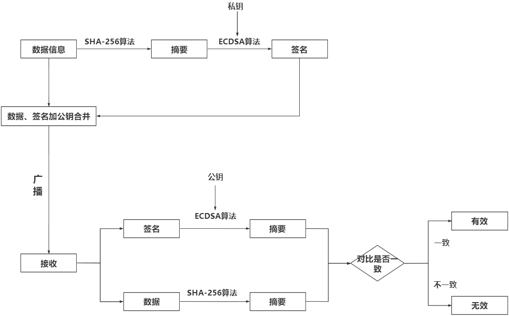
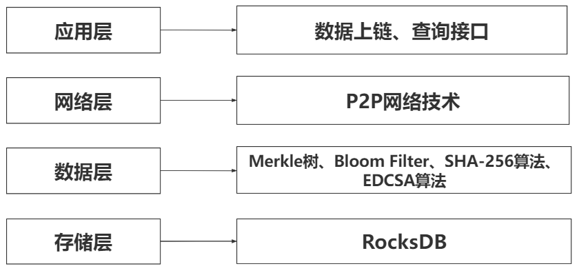

# blockchain-trace
该项目是使用Java实现区块链的一个学习项目，只限学习使用。
主要使用了Java1.8，mysql8，Rocks，其他的所需的依赖全在pom文件里面。

- 最新一次提交弃用了数据存mysql里面的做法，全存在Rocks里面，如果想参考数据存数据库的做法可以查看历史的commit记录
- 数据库代码为：
  ~~~ mysql
    create database block;
    use block;
    create table traces(
        hash varchar(256) primary key not null ,
        productName varchar(40) not null ,
        productPlace varchar(40) not null ,
        productTime varchar(40) not null ,
        producer varchar(40) not null ,
        distributor varchar(40) not null ,
        distributeTime varchar(40) not null ,
        retailer varchar(40) not null ,
        retailTime varchar(40) not null,
        recordTimeStamp varchar(40) not null
    );
  ~~~
- 该项目使用了，椭圆算法对数据进行签名加密，在取回数据时再方向进行签名的验证来判断数据的真实性。
- 在区块的内部Merkel树结构进行了优化，在每一个节点上新增了一个布隆过滤器，以在查找时对数据进行快速进行判断是否存在。
  伪代码：
  ~~~ java
    输入：产品序列号
    输出：产品具体信息
    Information find(String serialNumber){
    for(Block block: Blocks){
        if(区块头的布隆过滤器包含serialNumber){
            Node node = root;//root为merkle树根节点。
            if(node不是叶子节点){
            if(node.left节点布隆过滤器包含serialNumber){
                node = node.left;
                continue;
             }
            if(node.right节点布隆过滤器包含serialNumber){
                node = node.right;
             }
            }else{
                return node.information;
            }
        }   
    }
  return null;
  }
  ~~~
  在查找的过程不断剪枝以提高查询效率。
- 在最新一次提交新增了ArrayList结构来保存每一区块，在查询时只需查询ArrayList。而原先的使用RocksDB用前后hash值进行迭代方式历遍区块方式弃用。

# 详细思路

## 1.1  传统区块链查询方法 

### 1.1.1 传统区块链结构

  目前主流区块链系统的区块基础结构[10]如图1所示，在区块头中包含三组数据。第一组是通过哈希计算得出的Current Hash和指向父区块的Pre Hash，其值为父区块的Current Hash。通过Current Hash和Pre Hash链接区块链中的当前区块和前一区块；第二组由随机数（Nonce）、难度目标（Bit）和时间戳组成。这组数据与区块挖掘有关。随机值定义了区块挖掘难度，难度目标是指给定难度目标的Hash值，时间戳是指区块生成的时间，精确到秒；第三组数据是Merkle树根，它是本区块所包含的所有交易对应的Hash值两两循环计算得出的Hash值。

    
图 1 比特币区块结构图

  在进行交易验证时可以通过计算Merkle Tree Root的hash值来确认区块中的数据是否合法，有无被篡改。假设交易Tx1交易出了问题时，则可以通过Merkle Tree Root到Hash1 2到Hash1最后到Tx1的这条Merkle proof来进行非法数据的定位。

### 1.1.2 传统区块链查询方法

  在传统块索引结构的基础上，深入研究了传统区块链查询方法[11]，并给出了算法实现。通过对时间复杂度的计算，指出了传统区块链查询方法的不足之处，与之后的优化方法进行对比，体现优化后的方法具备的使用价值。

  如图2所示，为区块链结构。区块链是由区块的Hash值相链接一起的一种链表结构。当前的区块链索引结构只支持相对简单的查询，并且只支持基于唯一标识Hash值的查询。在区块链的链表结构中的查询某一数据最坏情况需要历遍整条区块链的数据才能查到数据，最优的情况只需要访问最新区块就可以查到，故其时间复杂度为O(N)，其中N为区块数量。找到对应区块后需要历遍区块体中的Merkle树结构的叶子结点，最后找到对应数据。在历遍Merkle树叶子结点需要的时间复杂度为O(2(n-1))其中n为交易数量。故总的查询时间复杂度为O(2(n-1)–N)，忽略常数项则查询时间复杂度为O(n–N)。

图 2 区块链结构示意图

区块链的传统查询算法如，算法1所示

~~~c++
算法1: 基于传统区块链结构的溯源查询
Require: Hash value h of transaction ticket number  of transaction
Ensure: Details of transaction result
1.	initialize the storage transaction details array result;
2.	n = Block().num;
3.	while n > 0 do
4.	     for j = 0 to block[n].transaction.num then
5.	           if  h == block[n].transaction[j].hash then
6.	               result.add( Block[n].transaction[j]);
7.	               n--;
8.	           end
9.	     end
10.	     n = n – 1;
11.	end
12.	if result.num == 0 then
13.	    return None;
14.	else
15.	    return result;
16.	end
~~~

  算法1先初始化了存储结果数据的数组result；在之后的外层while循环进行对区块的历遍，在内层的for循环中历遍该区块包含的交易数组。若找到结果则将数据存入result中。若result数组包含数据量为0则返回空的结果，表明未查询到数据，否则输出result数组。

## 1.2  基于优化区块链底层结构的溯源查询方法

  为了在优化区块链查询性能的目标基础上保证区块内数据的不可篡改性与可验证性，同时不增加区块链系统的复杂度。本文选择从区块链底层的数据结构入手，以改善区块链的溯源查询性能，拓展其查询功能。

### 1.2.1 优化区块链结构的溯源查询方法

  区块链的链表结构主要是通过前后区块的Hash指针值进行匹配链接，是为了保证区块链的不可篡改性与安全性。而区块对应的Hash值是通过区块内部本身数据计算得出的，再加上区块链上的区块是按照时间顺序添加到区块链上的。由此可以将“链”这一结构抽象化，把区块视为一个整体对象，区块链为一个包含合法区块的可变长数组。如图3所示：

图 3 区块链结构转换示意图

  将链表结构转为数组结构，数组中存储“区块”对象，根据区块头中的前区块Hash（Pre Hash）和当前Hash（Current Hash）进行抽象的“链接”。将“链”的概念抽象化，由于Pre Hash和Current Hash都是根据区块数据计算得出的，所以该方案同时也保证了数据的不可篡改性。其中区块所存数据（data）具体为如图1所示。

由于将区块链底层改成了数组结构，访问区块链任意区块的时间复杂度的从O(c1–n)变为O(c2–n)，n为区块链包含的区块数量，c1，c2为常数项，其中c1小于c2，优化了区块链的查询性能，还使得其有了随机访问任意区块能力。

同时在区块链系统中引入了缓存池的概念，假设一件商品有生产、分销、零售等流程。则设立生产缓存池，分销缓存池，分别保存商品从生产数据，分销数据。当有商品成功零售的时候，则将对应商品的生产缓存池和分销缓冲池中的商品数据取出与零售数据构成完整的溯源数据再将完整的溯源数据进行上链。这样在进行溯源查询时无需历遍全部区块的数据，只需要找到存在的唯一完整的溯源数据，减少了区块的查询次数，优化了区块链溯源查询性能。

### 1.2.2 优化Merkle树结构的溯源查询方法

  Merkle树[12]本质是一种二叉树结构，曾经在文件系统和P2P网络系统中广泛应用。

如图4所示，Merkle树具备以下特点：Merkle树的叶子结点存储数据或其对应Hash值；Merkle树的非叶子结点存储由其子结点中数据通过Hash计算得出的Hash值。

Merkle树在很多应用场景下都有着极为亮眼的性能表现，具体有以下三种：

  第一，比较大量数据：Hash值的计算快，而Merkle树通过叶子结点，从下往上循环计算至根结点的Hash值进行构建，上层结点Hash依赖于下层结点的Hash值。故只需比对构建出的Merkle树的树根Hash值与原Merkle树根Hash值是否一致，就可以在短时间内比较数据。

  第二，快速定位修改：在图4中，数据集中的L1，L2，L3，L4都有唯一的Merkle proof到Top Hash，若L1，L2，L3，L4任意数据发生改变，都会影响到Top Hash。当Top Hash值发生变化的时候，就可以沿着Top Hash最多使用O(logn)的时间通过Merkle proof定位到发生变化的数据。

  第三，零知识证明：如下图4所示，可以通过Merkle proof证明数据集（L1，L2，L3，L4）的某个数据L2存在，而不用暴露其他数据。

图 4  Merkle树示例图

为了优化区块链的溯源查询性能，本文对区块链中Merkle树的结构进行了优化，引入了布隆过滤器（Bloom Filter）[13]这一数据结构。

  Bloom Filter本质上是一个很长的二进制向量和一系列随机映射函数，用于快速确定一个元素是否在一个集合中。在初始状态Bloom Filter的所有位都被置为0，如下图5所示：

 

图 5 Bloom Filter初始状态

图 6 Bloom Filter映射数据到位数组示意图

将变量添加到集合中时，该变量将通过K个映射函数映射到位数组中的K个点，并将其值设置为1（假设有两个变量，每个变量通过三个映射函数）。根据Bloom Filter的特性，如图6所示在判断变量obj1是否存在集合中只需看二进制向量数组中下标为1、3、12对应值是否为1。若其中任意一个下标对应值为0，则obj1变量不存在该集合中，若对应值全为1，则变量很可能存在。因为映射函数本质上是哈希散列函数，存在哈希碰撞，如图6中，变量obj1和变量obj2通过映射函数Fun2都会映射到二进制向量数组下标为3的元素中。

同时与其他数据结构相比，Bloom Filter在空间和时间上都有很大的优势。Bloom Filter存储空间和插入及查询时间是常量的O(k)，k为常量。Bloom Filter不需要存储元素本身，这有效保证了数据的隐私性、安全性。Bloom Filter与其他数据结构相比最大的一个特点是可以表示数据全集，基于这个特点，可以丰富区块链溯源查询性能的语义查询功能让其不只仅支持交易的Hash等语义简单的查询。

优化后Merkle树结构如图7所示，其中BF为Bloom Filter简写，BF（1,8）表示该结点的Bloom Filter完成了交易Tx1到Tx8信息到位数组的映射。（Tx1…Tx8)为交易数据列表，（Hash1…Hash8）为叶子结点。该Merkle树的叶子结点存储真实数据对应的hash值，非叶子结点存储其左右子结点计算得出的hash值。

图 7 结合Bloom Filter的Merkle树结构

优化后Merkle树构建算法如算法2所示

~~~c++
算法2: 优化后Merkle树构建算法
Require: Transaction list T
Ensure: Improved Merkle tree
1.	for i = 0 to T.num do 
2.	    MerkleTree.leafnode = <Hash(T[i])> 
3.	end
4.	for i = leafnode.Size() to 1 do
5.	    i = (i+1)/2;
6.	    for j = 1 to i do
7.	        Hash(i,j) = Hash(Hash(Hash.l|Hash.r)|BF(i,j));
8.	        MerkleTree.node = <Hash(i,j),BF>
9.	    end
10.	end
11.	return MerkleTree;
~~~

  该算法的1-3行计算Merkle树叶子结点对应的Hash值，4-10行根据叶子结点的Hash值循环构建上层非结点直至Merkle树的根结点，最后输出结构优化后的Merkle树。

  由于该方案只在Merkle树本身结构上增加了Bloom Filter结构，不影响Merkle树本身的特性，故其仍具有防篡改、比对数据、快速定位、零知识证明等功能。

  根据结构优化后的Merkle树设计查询算法[14]，如算法3所示：

~~~c++
算法3: 基于优化Merkle树的查询算法
Require: transaction index
Ensure: Details of transaction result
1.	for i = (Block.num – 1) to 0 do
2.	   temp = Block[i].MerkleRoot;
3.	   if temp.BF.contain(index) then
4.	        while (temp not LeafNode) do
5.	             if temp.LeftNode.BF.contain(index) then
6.	                  temp = temp.LeftNode;
7.	             else 
8.	                  temp = temp.RightNode;
9.	             end
10.	        end
11.	    else
12.	        continue；
13.	    end
14.	    if Hash(index) == temp.Hash then 
15.	         result = temp.information
16.	    end
17.	return result;
18.	end
~~~

  在算法3中，通过外层for循环历遍全部区块，在历遍区块链时查看每个区块的Merkle Root的Bloom Filter进行数据的快速判断检测，如果不包含数据则跳过当前区块，去查询下一区块。不需要历遍区块内全部数据，提高了查询效率。若Merkle Root中Bloom Filter判断存在查询数据则进入Merkle树结构，从上往下访问子结点的Bloom Filter判断数据在左子树或右子树，进行一个剪枝操作，提高查找效率。

# 2  基于区块链的溯源系统的设计与实现

本文该部分内容结合商品的溯源流程与真实场景的应用，分析、设计、实现了基于优化后区块链底层数据结构的商品溯源查询系统。

## 2.1  系统设计

### 2.1.1 系统业务流程

  在商品溯源场景中，业务主要由生产商、分销商、零售商参与，生产商与分销商将数据写入该区块链系统的对应“缓存池”中，当零售商成功将商品售卖出去时则，将零售数据与“缓存池”中对应的商品数据组合成完整的溯源数据信息，并将其上链。具体业务流程如图8所示：

图 8 商品溯源查询系统业务流程示意图

  在生产区块与构建Merkle树中，由于SHA-256算法具有单向性与独立性。本文采用了SHA-256[15]这一哈希加密算法，以保证数据的完整性。具体加密流程如图9所示：

图 9 哈希加密流程图

  同时在数据上链过程中，本文采用了ECDSA算法[16]这一非对称加密算法，给每一个环节的数据加了一个签名，主要进行生产商、分销商、零售商与普通用户的角色判定，证明消息的来源。具体流程如图10所示。

图 10 数字签名验证流程图

### 2.1.2 系统总体架构

本文主要探索对区块链底层数据结构优化，以改善区块链的溯源查询性能，故本溯源查询系统的总体架构[17]为图11所示，移除了共识层。只有生产商、分销商、零售商有增加数据权限，普通用户只有查询权限。

在本区块链系统中，取消了“挖矿”这一POW共识机制[18]，依靠数字签名进行用户权限的认证，新增区块的判断由系统本身设定值，当交易量到达一定值时自动验证数据并生成区块。在利用RocksDB将数据以物理链式结构写入本地文件，加载区块链时将RocksDB中的数据写入运行内存的一个动态数组中，将物理的链表结构变为抽象概念上的链式结构。

图 11 本系统架构示意图

# 3   实验与结果分析

本章基于上一章设计实现的商品溯源查询系统，完成对商品传统溯源查询性能与优化后的查询性能进行比对，通过实验结果验证了优化区块链底层数据结构的优化方案的可行性。

## 3.1  实验环境

  本文主要通过优化区块链底层数据结构进行区块链的溯源查询性能优化，为排除网络延迟等各种因素干扰，本次实验只设立了一个主节点，即本机开发环境。

具体本地实验环境如表1所示：

表 1 实验环境配置表

| 类型         | 名称     | 描述                                              |
| ------------ | -------- | ------------------------------------------------- |
| 本地硬件环境 | 开发环境 | 操作系统：Win10  CPU：Intel Core 8th i5  内存16GB |
| 本地硬件环境 | 测试环境 | 操作系统：Win10  CPU：Intel Core 8th i5  内存16GB |

表 1 实验环境配置表（续表）

| 软件环境 | Java               | 运行环境：JDK1.8 |
| -------- | ------------------ | ---------------- |
| IDEA     | 运行版本：2022.1.3 |                  |
| PostMan  | 运行版本：8.12.1   |                  |
| RocksDB  | 运行版本：7.03     |                  |

## 3.2  实验结果

  在本地测试环境下进行一定量数据的分析测试，对本溯源查询系统的各方面性能进行了定性、定量的分析，得到了预料中的结果，实验取得成功。

### 3.2.1 定性分析

由于Bloom Filter存储空间和插入及查询时间是常量的O(k)，且算法2构建优化后Merkle树相比于传统Merkle树构建算法只在非叶子节点额外添加了Bloom Filter结构，额外花费的时间和空间都为(n-1)–O(k)，n为该区块的信息数量，O(k)为常数。故构建优化Merkle树，额外花费的时间空间都是很小的。

根据上文算法1基于传统区块链的溯源查询算法和算法3基于优化Merkle树的查询算法进行该系统定性分析。设区块链的区块数目为n，区块最大数据数量为m，包含所查询数据的区块数量为k。

算法1历遍所有区块的时间复杂度为O(c1–n)，算法3的时间复杂度为O(c2–n)，c1和c2为常数项。因为优化后的Merkle有Bloom Filter结构，可以直接判断区块是否包含所查询数据，若无则不进入该区块的Merkle树结构，故c1大于c2。

算法1在进入区块后需要查询数据集合，其时间复杂度为O(k–m)，传统区块链中溯源查询的数据可能分布在多个不同区块中，故需要进行k次查询。算法3在进入区块后，由于Merkle树的结点中包含了Bloom Filter可进行剪枝操作，且由于溯源数据统一上链k=1，故该过程时间复杂度为O(logm)。

同时将区块链底层改成了数组结构，历遍全部区块的时间复杂度的从O(c1–n)变为O(c2–n)，n为区块链包含的区块数量，c1，c2为常数项，其中c1小于c2，还使得其有了随机访问任意区块能力，在常数项上优化了区块链的溯源查询性能。

算法1时间复杂度为O(c1–k–n–m)，算法3时间复杂度为O(c2–n–logm)算法3的时间复杂度小于算法1，故该优化方案在溯源查询效率上有了极大的提高。

### 3.2.2 定量分析

  设置一定数量的区块和数据集，通过本地实验得出以下数据图表，展示了传统溯源查询性能与优化后溯源查询性能的差距。根据图12、图13、图14所示，该方案对区块链溯源查询性能有着不错的效率提升，同时额外耗费的Merkle树构建成本低。

如图12所示，为固定每区块包含16个交易数据时，查询时间与区块数量关系折线图。

图 12 查询时间与区块数量关系折线图

如图13所示，该图为Merkle树构建成本与当前区块包含交易数量关系折线图。

图 13 Merkle树构建成本与交易数量关系折线图

如图14所示，为固定16个区块时，查询时间与交易数量关系折线图。     

图 14 查询时间与交易数量关系折线图